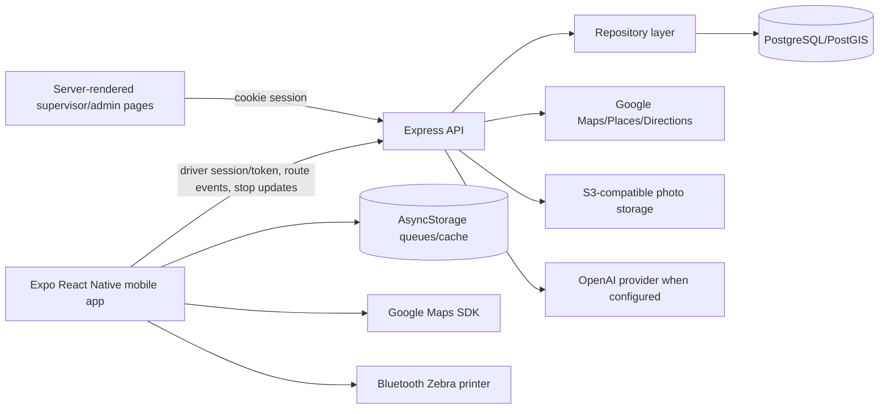

# Current Architecture

## Responsibilities

Backend API handles routing, route manifests, delivery notes, drivers, admin pages, account intelligence, AI endpoints, heatmaps, operational geography, data imports, auth/session handling, and readiness checks.

Mobile handles route execution, navigation UI, delivery settlement, offline queues, hazard reporting, inventory confirmation, barcode scanning, signatures, and Zebra printing.

## Trust Boundaries

Driver mobile auth, admin cookie sessions, Google APIs, OpenAI, object storage, and future Organization tenant boundaries are separate trust zones. Organization context is documented but not implemented end-to-end.

## Failure Points

Google outage/quota, offline queue replay, missing production env, DB migration failure, unscoped exports, AI data leakage, and large coupled route modules.
