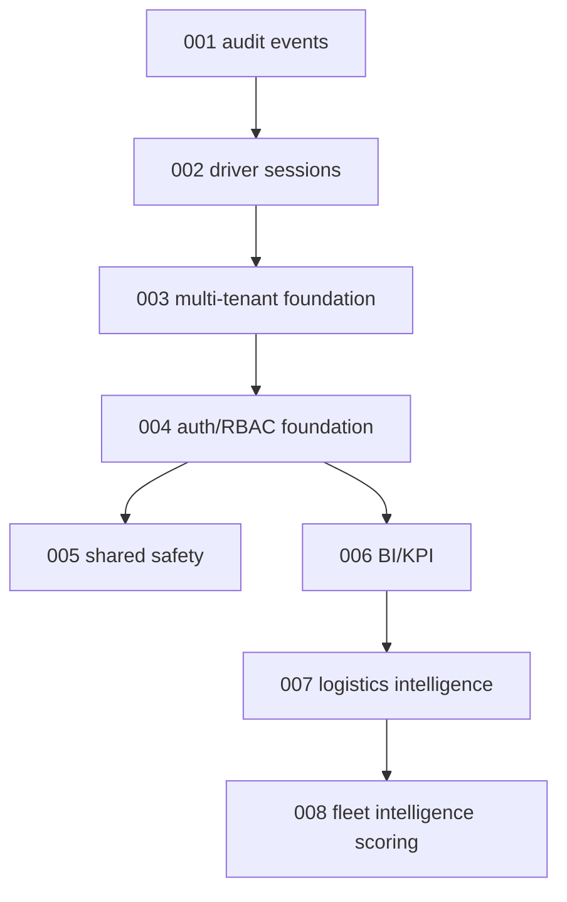

# Migration Dependency Graph

Strict ordering:

- 003 requires existing operational tables and creates the Organization tenant boundary.
- 004 requires Organizations and inserts approved role permissions.
- 005, 006, 007, and 008 require Organizations and role permissions.
- 008 depends on Logistics Intelligence outputs for meaningful scoring, even though the schema is separately additive.

Deployment compatibility:

- Current code expects the merged schema for production use of Shared Safety, BI/KPI, Logistics Intelligence, FISS, warehouse sessions, and pilot integration validators.
- Because `npm start` runs migrations before server start, migration-first is the repository's current deployment behavior.
- A safer production rollout should explicitly run database preflight and backup verification before allowing the Render service to start new code that applies migrations.
